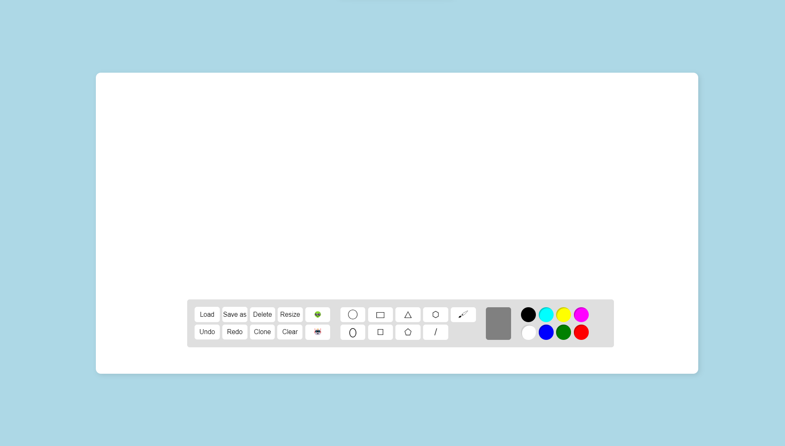
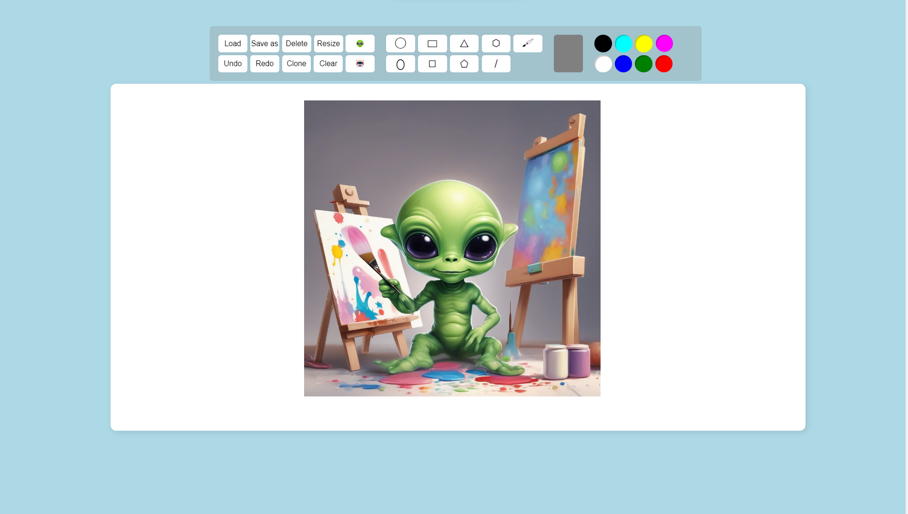

# Paint

This Paint App is a dynamic drawing application that synergizes Vue.js for a responsive frontend and Spring Boot for a robust backend. Vue.js ensures a smooth user interface, while Spring Boot handles backend operations and API integrations. This collaboration enables real-time synchronization, enhancing performance. The app leverages APIs for features like an AI image generator, image import, and versatile file format support. This amalgamation positions the Paint App as a versatile and user-friendly tool, empowering users to bring their artistic visions to life.

---

## **Features Overview:**

1. **Draw Shapes (Circle, Ellipse, Triangle, Square, Rectangle, Line, Pentagon, Hexagon) By Mouse Dragging:**
    - The application supports drawing various shapes by dragging the mouse, including circles, ellipses, triangles, squares, rectangles, lines, pentagons, and hexagons.
2. **Free-Hand Drawing:**
    - Users can engage in free-hand drawing, allowing them to create custom shapes or patterns on the canvas.
3. **Cloning:**
    - The cloning feature enables users to duplicate existing shapes, providing a convenient way to reproduce elements on the canvas.
4. **Coloring + Color Picker:**
    - Shapes can be colored using a color picker, giving users the flexibility to choose a wide range of colors for their drawings.
5. **Selection + Window Selection:**
    - Users can select individual shapes or perform window selection to choose multiple shapes at once. This makes it easier to manipulate and manage groups of shapes.
6. **Grouping:**
    - Grouping functionality allows users to combine multiple shapes into a single group, simplifying the manipulation of related elements.
7. **Resize:**
    - Shapes can be resized, giving users control over the dimensions of each element on the canvas.
8. **Scaling:**
    - Scaling functionality allows users to proportionally adjust the size of shapes, maintaining their aspect ratios.
9. **Rotate:**
    - Shapes can be rotated, providing users with the ability to orient elements in different directions.
10. **Move:**
    - Users can move shapes across the canvas, repositioning them as needed.
11. **Delete:**
    - Shapes or groups of shapes can be deleted, allowing users to remove unwanted elements.
12. **Clear All:**
    - The "Clear All" feature removes all shapes from the canvas, providing a quick way to start fresh.
13. **Undo:**
    - The undo functionality lets users revert the canvas to its previous state, step by step.
14. **Redo:**
    - The redo functionality allows users to reapply actions that were undone, restoring the canvas to a later state.
15. **Save as XML, JSON, Image:**
    - Users can save their drawings in different formats such as XML, JSON, or as image files.
16. **Load XML, JSON:**
    - Drawings saved in XML or JSON format can be loaded back into the application for editing.
17. **Import Images 👽:**
    - Users can import external images into the canvas, providing additional elements for their drawings.
18. **AI Image Generator 🤖:**
    - The application features an AI image generator, allowing users to create images automatically through artificial intelligence algorithms.

---

## **Design Patterns Applied:**

1. **Factory Method Pattern (in `ShapeFactory`):**
    - The **`ShapeFactory`** class acts as a factory method pattern. It encapsulates the logic for creating different types of shapes based on the provided **`shapeType`**. This pattern promotes flexibility by allowing the addition of new shape types without modifying existing code.
2. **Singleton Pattern (in `ShapeManager`):**
    - The **`ShapeManager`** class follows the singleton pattern, ensuring that only one instance of the manager exists throughout the application. This is useful for maintaining a centralized point of control for managing shapes and their history.
3. **Command Pattern (in `ShapeManager` for undo and redo):**
    - The undo and redo functionality in the **`ShapeManager`** follows a command pattern. Each change in the state of the shapes is considered a command, and the manager keeps a history of these commands. Undo and redo operations execute these commands in reverse or forward order.

---

## **Design Overview:**

1. **Interface Segregation:**
    - The **`Shape`** interface follows the Interface Segregation Principle, as it defines only the methods relevant to a shape, avoiding unnecessary methods that might not be applicable to all shapes.
2. **Inheritance and Polymorphism:**
    - The use of inheritance and polymorphism is evident in the various shape classes (**`Circle`**, **`Rectangle`**, **`PolygonShape`**, etc.). It allows for treating objects of derived classes uniformly through the common **`Shape`** interface.
3. **Encapsulation:**
    - Each shape class encapsulates its attributes and behavior, providing a clean and modular design. This encapsulation ensures that changes to one part of the system don't affect other parts.
4. **Composition over Inheritance (in `Square`):**
    - The **`Square`** class extends **`Rectangle`**, showcasing a form of composition over inheritance. It inherits behavior common to rectangles and adds specific behavior for a square without duplicating code.
5. **RESTful API Design:**
    - The **`ShapesController`** class follows RESTful API design principles, with different HTTP methods (**`POST`**, **`PUT`**, **`GET`**, **`DELETE`**) corresponding to specific actions on shapes. This makes the API intuitive and easy to use.
6. **Serialization/Deserialization:**
    - XML and JSON serialization/deserialization in the **`ShapeManager`** demonstrates a flexible approach for saving and loading shapes. Different formats can be easily added in the future.
7. **Command and History Management:**
    - The **`ShapeManager`** effectively manages a history of shape states, providing undo and redo functionality. This aligns with the Command Pattern, where each action is a command, and the manager keeps a record of these commands.
8. **Annotation-Based Configuration (in `ShapesController`):**
    - The use of annotations from the Spring Framework (**`@RestController`**, **`@PostMapping`**, **`@PutMapping`**, etc.) simplifies the configuration and mapping of HTTP requests to methods.

---

## **UML Diagram:**

This section provides a high-level overview of the Unified Modeling Language (UML) representation for the Drawing Application. UML diagrams serve as visual aids to understand the structural and behavioral aspects of the application's design.

---

## Frontend Structure:

### **1. Shape Creation API Functions (`CreateCircle`, `CreateEllipse`, ...):**

- Each function corresponds to a specific shape type (circle, ellipse, rectangle, image, etc.).
- The functions use the **`fetch`** API to send a **`POST`** request to the corresponding backend endpoint (**`http://localhost:8080/circle`**, **`http://localhost:8080/ellipse`**, etc.).
- They pass shape information (e.g., position, dimensions, color) in the request body as JSON.
- After posting, they log the success message and return the response data.

### **2. DrawingFunctions Module:**

- **`createFromJson(shape)`**:
    - Creates a Konva shape based on the provided JSON data.
    - Handles different shape types (circle, ellipse, rectangle, etc.) using a switch statement.
    - Adds the new shape to the Konva layer and calls **`toBackend`** to save it on the backend.
- **`toBackend(shape, type)`**:
    - Saves a Konva shape to the backend using the corresponding API function (e.g., **`CreateCircle`**, **`CreateEllipse`**, etc.).
- **`createShape(pos)`**:
    - Creates a new Konva shape based on the drawing mode (**`drawingShape`**) and the current color.
- **`startDrawing(event)`**:
    - Initiates the drawing process based on the selected shape.
    - Calls the corresponding API function to create the shape on the backend.
- **`stopDrawing(event)`** and **`drawing(event)`**:
    - Handle the end and ongoing drawing processes, respectively.
    - Update the shape's properties and call the corresponding API function for real-time updates.

### **3. HistoryFunctions Module:**

- **`undo()`** and **`redo()`**:
    - Handle undo and redo actions by navigating through the history array.
    - Send requests to the backend (**`http://localhost:8080/layer/undo`**, **`http://localhost:8080/layer/redo`**) for server-side history management.
- **`drawNewLayer()`**:
    - Updates the Konva layer based on the current state in the history array.
- **`clearHistory()`**:
    - Clears the history array up to the current history index.
- **`saveRecord()`**:
    - Saves the current state of the Konva layer to the history array.
    - Sends a request to the backend (**`http://localhost:8080/layer/record`**) for server-side recording.

### **4. UpdateFunctions Module:**

- **`getType(shape)`**:
    - Determines the type of a given Konva shape (circle, rectangle, ellipse, etc.).
- **`updateShape(shape)`** and **`createShape(shape, id)`**:
    - Update or create a shape on the backend based on its type.
    - Use the corresponding API functions (**`UpdateCircle`**, **`CreateRectangle`**, etc.).

### **5. Miscellaneous:**

- **`forceLoadImage`**:
    - A utility function that returns a Promise, resolving when an image is fully loaded.
- **`downloadImage(url, fileName)`**:
    - Downloads an image from the specified URL with an optional filename.

---

## Conclusion:
In summary, Paint is a collaborative Vue.js and Spring Boot application that offers a seamless drawing experience. With a user-friendly interface, versatile features like shape creation, free-hand drawing, and AI image generation, Paint provides a dynamic canvas for creativity. The README provides a comprehensive guide, covering features, design patterns, and the application's structural overview. Paint invites users and developers to explore its possibilities and contribute to a vibrant artistic community.

Happy Drawing! 🎨